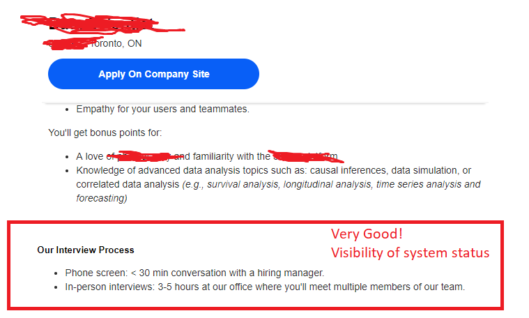
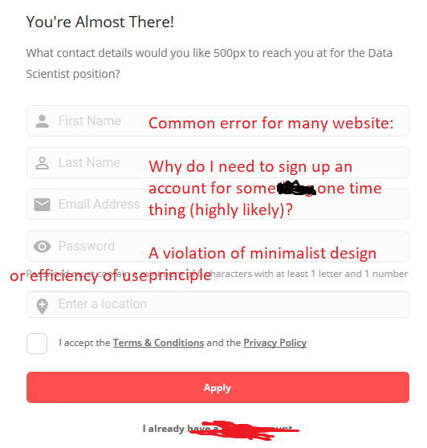
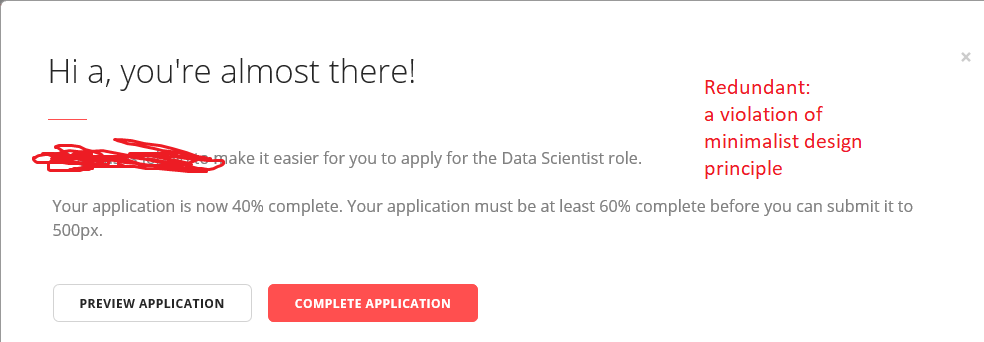
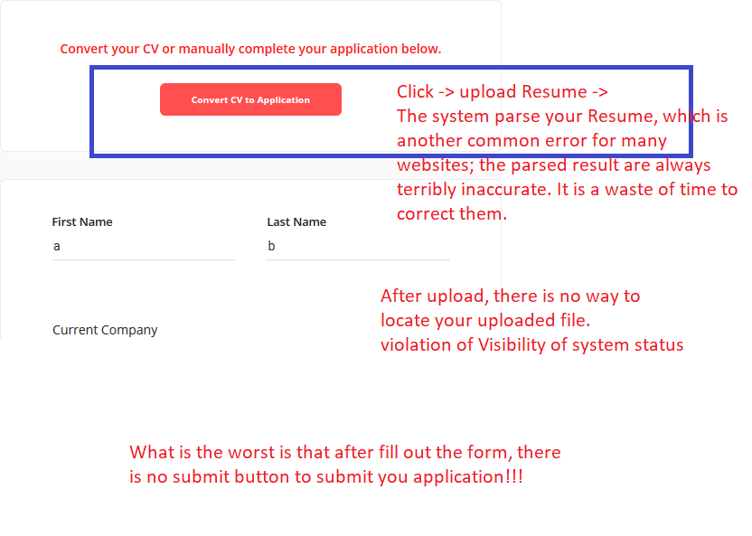
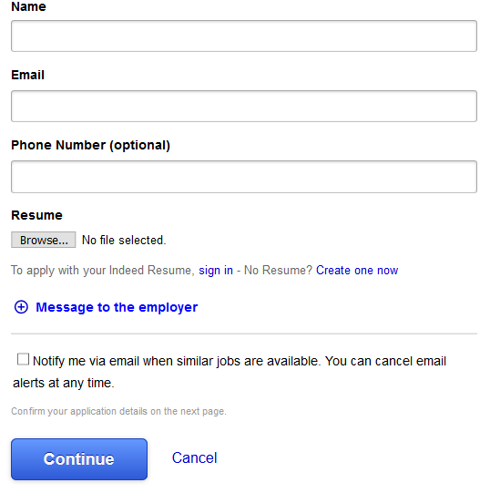

# Obvious user experience errors to avoid: A brief heuristic evaluation of a job application website
#### auther: Corey(Yalin) Chen
#### corey.about@gmail.com
Note: This article only represents one evolution of a product, rather than the ability of persons behind the product, for the educational purpose.  
  
Severity Ratings (Nielsen):  
`0 = I don't agree that this is a usability problem at all`  
`1 = Cosmetic problem only: need not be fixed unless extra time is available on project`  
`2 = Minor usability problem: fixing this should be given low priority`  
`3 = Major usability problem: important to fix, so should be given high priority`  
`4 = Usability catastrophe: imperative to fix this before product can be released`  
  
Recently I encountered one job seeking website. I think it could be a case with classical educating values in user experience. It looks very nice and modern by appearance for many parts, but here I mostly focus on the negative parts for the educational purpose.  
  
One nice good point to start with,  
#### 1. Displayed the interview process with the job posting, which is very nice and follows the visibility of system status rule. 
The user has more informed -> happy -> more likely to apply.  

After click Apply on Company Site, problems start to begin.
  
#### 2. Why does many websites requires an account for some one-time thing? Severity Rating: 3
Account sign up -> Wasting user’s time.  

One could say, in any case, most of the information here is need for a job application. Fine, let’s move on. Right after signing up,  
#### 3. A unnecessary alert appeared. Severity Rating: 2
Of course, application is not finished from the previous screen (e.g., not resume so far).  
Extra reading and click for no purpose -> Wasting user’s time.

Afterwards,   
#### 4. Please do not use the function to auto parse the Resume uploaded!  Severity Rating: 3  
The automatic parsing function, may be fancy by appearance, is always terribly inaccurate, and required many corrections -> Wasting user’s time.  

After upload,  
#### 5. No way to check the uploaded file. Severity Rating: 3  
How does user check the uploaded file? -> no control or freedom.  
Lastly, and most importantly:  
#### 6. The submit button somehow disappeared after filling out the long form!!! Severity Rating: 4
The is a tragedy.  
On the opposite, indeed did a very good job.  

That’s all you need for the job application and it takes seconds to complete!
